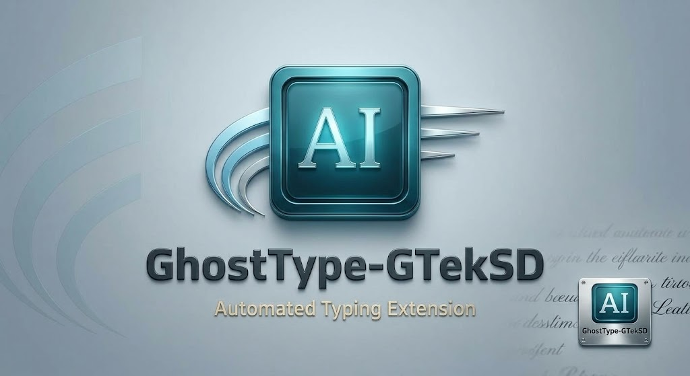

# GhostType - GTekSD

  

GhostType is a browser extension for automated text entry and DOM event simulation in supported browser form fields. It lets you prepare multiple text snippets and types a selected snippet into the active editable field.

## Features

- Three text fields are available by default; add or remove fields as needed.
- Paste, clear, start, and stop controls for each text field.
- Adjustable typing speed and an optional Human mode for simulated pauses and typing corrections.
- A context-menu action to open the side panel and start typing in an editable field.
- Text snippets and settings are stored locally by the extension.

## Install in Microsoft Edge

1. Download or clone this repository and extract it if downloaded as an archive.
2. Open `edge://extensions`.
3. Enable **Developer mode**.
4. Select **Load unpacked** and choose the project folder containing `manifest.json`.
5. Open the GhostType side panel, enter text, focus an editable field on a page, and select **Start**.

## Firefox build

Firefox uses a separate manifest and background script with its native sidebar. Build its AMO upload package by running `.\firefox\build.ps1` in PowerShell. To test it locally, extract the generated ZIP, open `about:debugging`, select **This Firefox** → **Load Temporary Add-on**, and choose the extracted `manifest.json`.

The root package targets Chromium browsers such as Chrome and Edge; the Firefox package uses Firefox-specific extension APIs. Compatibility with individual websites and editors varies.

## Important limitations

GhostType simulates typing by dispatching DOM events. These events are synthetic, not trusted physical keyboard input; a website may ignore or reject them. GhostType does not bypass paste restrictions, access controls, or other site security measures. Use it only on pages and forms you are authorized to test.

## Development

The extension is built with the browser extension APIs and plain JavaScript, HTML, and CSS. Load the project folder as an unpacked extension to test local changes.
